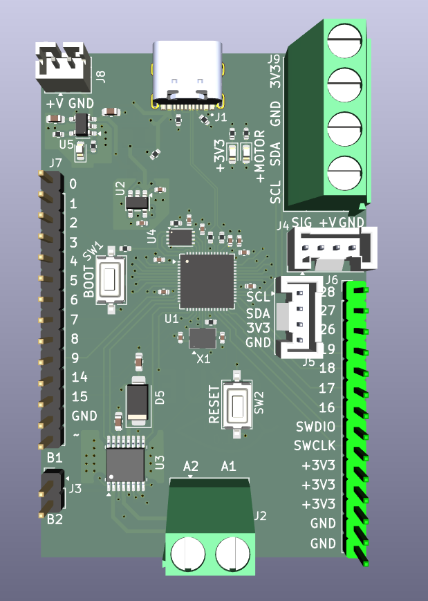
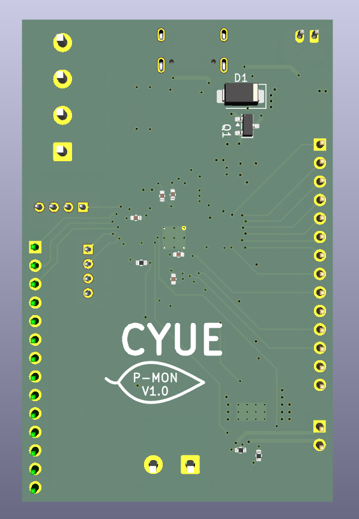
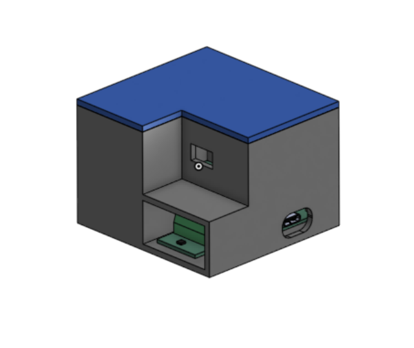
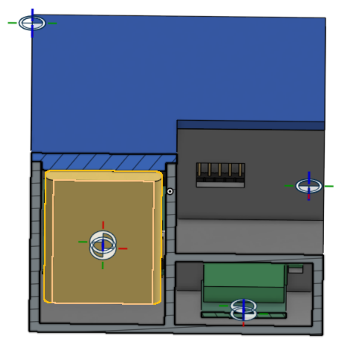
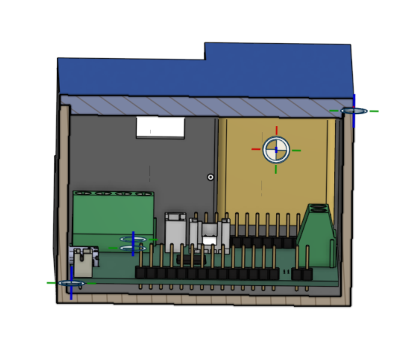

<h1>Plant Monitor</h1> 

This smart, fully automated plant monitor system monitors soil moisture, atmospheric temperature/pressure, and humidity to determine when to water the plant, and then uses a small pump to water the plant. This is meant to be a project where I learn how to design a PCB, and it is also my first project with HackClub so I am getting used to this type of work. I plan to build upon this project in the future and create an automated gardening system. 

The PCB in this project uses an RP2040 microcontroller. The power can either be supplied through USB connection or battery; when the USB is plugged in it charges the battery and takes priority in powering the RP2040 as well. The main external modules are: BME280 for temperature/humidity/pressure sensing, SSD1315 OLED display to display some basic information to user such as soil moisture/time till next watering, Maker Soil Moisture Sensor, 1S LiPo battery for power, and 4.5V DC water pump for a cheap way to water the plant. I also found some cheap tubing for the water pump as well. Below are pictures of the components:

How is this plant monitor more intelligent than others? Well, I decided I'd complicate it a little and train a machine learning model on the gathered data. To do this, I added time of day and then did some data augmenting. Specifically, I added one small piece to each datapoint: the actual evaporation rate, which can be determined by finding the time until the plant was watered at each datapoint and determining the change in soil moisture over that period of time. Using online sources (and some AI), I determined a proper equation with trainable parameters to determine evaporation rate given my input variables. Then I simply copied the parameters over to the firmware on the RP2040 and integrated the rate function (with the help of online sources and AI) to determine the time until the next water. I considered using a small neural network and then porting it over using TensorFlow Lite, but I felt like that would be overkill given that I only have like 4 trainable parameters. 

