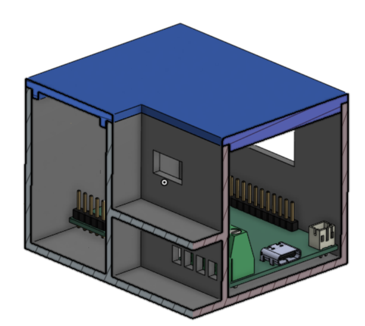
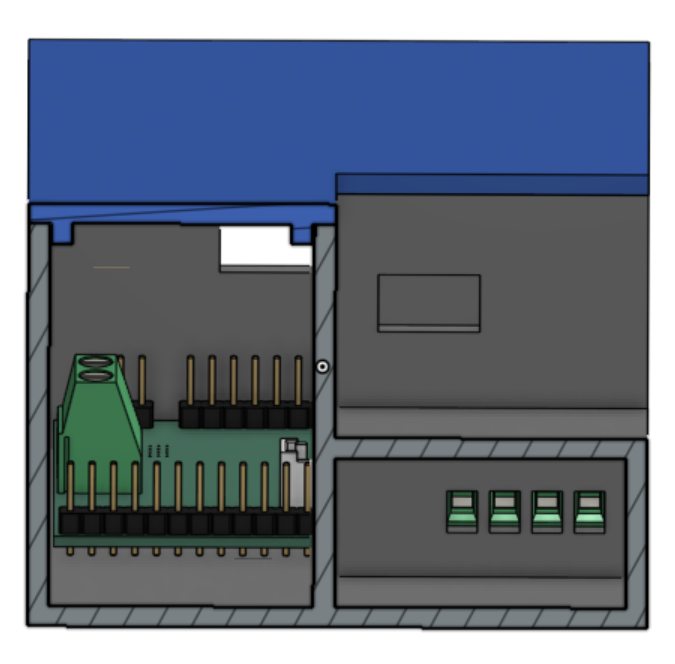
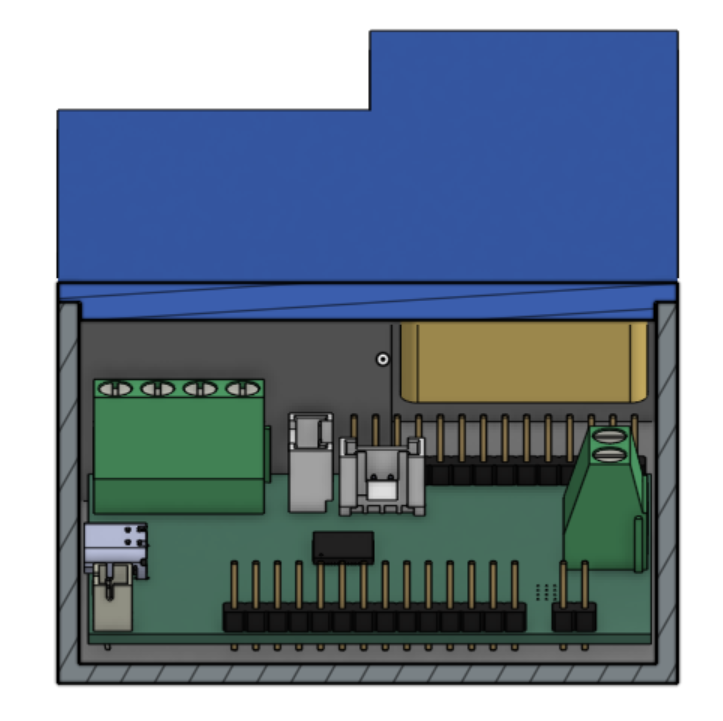
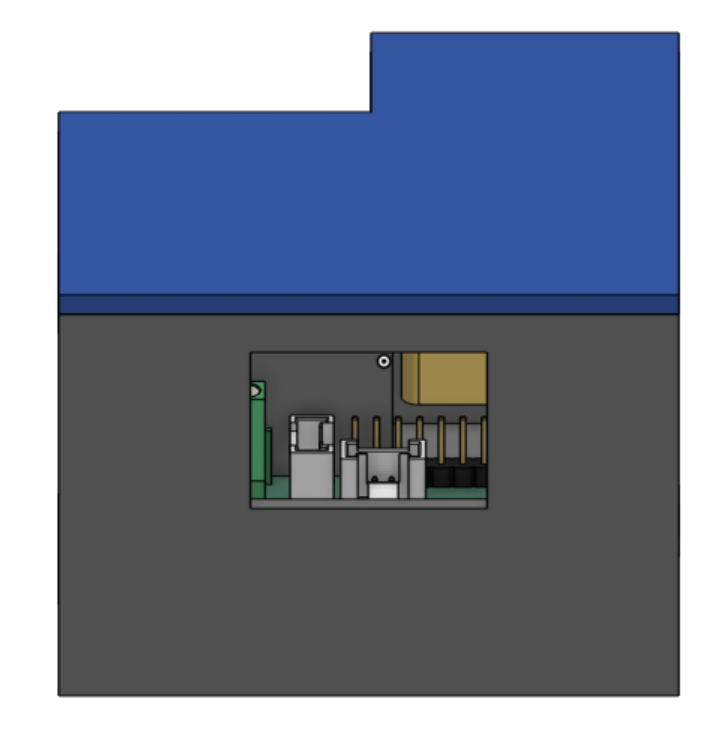
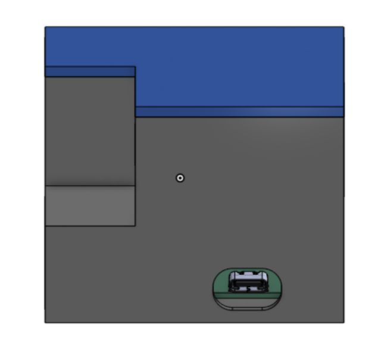

<h1>Plant Monitor</h1> 

This smart, fully automated plant monitor system monitors soil moisture, atmospheric temperature/pressure, and humidity to determine when to water the plant, and then uses a small pump to water the plant. This is meant to be a project where I learn how to design a PCB, and it is also my first project with HackClub so I am getting used to this type of work. I kept it somewhat simple this time; if my custom devboard is successful I plan to build upon this project in the future and create an automated gardening system with a web dashboard.

The PCB in this project uses an RP2040 microcontroller. The power can either be supplied through USB connection or battery; when the USB is plugged in it charges the battery and takes priority in powering the RP2040 as well. The main external modules are: BME280 for temperature/humidity/pressure sensing, SSD1315 OLED display to display some basic information to user such as soil moisture/time till next watering, Maker Soil Moisture Sensor, 1S LiPo battery for power, and 4.5V DC water pump for a cheap way to water the plant. I also found some cheap tubing for the water pump as well. Below are pictures of the main PCB and the full assembly (with the small PCB for the BME280 as well). The tank for the water will be a separate plastic container; the DC motor is submersible (IP68) and so I can just directly place it in the water. 

How is this plant monitor more intelligent than others? Well, I decided to train a machine learning model on the gathered data so that it can predict the time until the next watering, which allows the user to know when to refill the water in the tank. To do this, I added time of day and then did some data augmenting. Specifically, I added some features to the data like moisture rate changes over the past 1, 3, and 6 hours to allow the model to understand how moisture is changing over time, and I also calculated the actual time until the next watering to allow for back propagation. The model's prediction is usually within +- XXX% of the actual time, which I believe is more than sufficient. External wiring is extremely minimal; the only thing which I hooked up was a button (on a breadboard) to pin 19 which connects to ground when pressed and toggles the OLED display. The BME280 breakout is also located on that same breadboard; OLED is secured to the gap in the front of the case and connected to the Grove connector; the soil moisture sensor is connected to the Grove connector and stuck into the soil; the DC motor is connected to the screw terminals and submersed in a separate plastic water tank. The battery is housed in the back corner of the case and connected into the JST 2P terminal. 

Bill of materials (NOTE: I am only requesting $50 dollars of funding, the PCB is very expensive so I will pay for it myself as I really want the bits towards qualification but now I know in the future to keep my PCB cheap by making it larger, using basic components, placing all components on one side for top-side assembly which saves $25; I may even consider designing my own at-home pick-and-place and reflow oven for future projects, as all I have right now is a 10-year old soldering iron that my dad used to use).

| Name                 | Purpose                                                                                                        | Quantity | Total Cost (USD) | Link                                                                                                                                                                                                                                                                                    | Distributor  |
|----------------------|----------------------------------------------------------------------------------------------------------------|----------|------------------|-----------------------------------------------------------------------------------------------------------------------------------------------------------------------------------------------------------------------------------------------------------------------------------------|--------------|
| Grove Connectors     | JLCPCB is out of stock so I need to get these and solder them myself                                           | 1        | 0.99             | http://seeedstudio.com/Grove-Universal-4-pin-connector.html?srsltid=AfmBOorW7PKIxB2nBkeDA8cmDVeIM7P4xw2DvOuiTnTy1p6jJHWLyXrN                                                                                                                                                            | Seeed Studio |
| Grove Cables (5pc)   | Connect the modules which have the Grove connectors                                                            | 1        | 3.2              | https://www.seeedstudio.com/Grove-Universal-4-Pin-20cm-Unbuckled-Cable-5-PCs-Pack-p-749.html?srsltid=AfmBOoq_PWPlUHW6AhA9C06W1DHX0IDENz6RkAf7MmArpoaDusm0fHTv                                                                                                                           | Seeed Studio |
| PVC tubing           | Tubing for DC water pump to transport water to plant                                                           | 1        | 1.5              | https://www.adafruit.com/product/4545                                                                                                                                                                                                                                                   | Adafruit     |
| 0.96"" OLED Display  | To display information to user (soil humidity, time until next watering)                                       | 1        | 5.5              | https://www.electromaker.io/shop/product/grove-oled-yellowblue-display-096-ssd1315-spiiic-33v5v?gad_source=1&gad_campaignid=17338710367&gbraid=0AAAAAB8F3FmRMabQ0J10iEwfIvI6VSl6a&gclid=Cj0KCQjwkMjOBhC5ARIsADIdb3d52XNHvB0xUx85szcmNXmzkSiIRx9xRBb809RG0A6VtOCNXQ8NJkkaAqXOEALw_wcB    | Electromaker |
| LiPo battery         | To power the RP2040 so that I don't need to keep the USB plugged into something - modular design               | 1        | 7.95             | https://www.digikey.com/en/products/detail/adafruit-industries-llc/1578/5054539?gclsrc=aw.ds&gad_source=1&gad_campaignid=20243136172&gbraid=0AAAAADrbLlhvKmgdjMr2ASbfNgFbFfC-K&gclid=CjwKCAjwhLPOBhBiEiwA8_wJHHKKz7rCEnEKWuYEBjjljwh4XTezaZe1PkV-ABDO55FqAjQQXDC_LhoCzSYQAvD_BwE        | Digikey      |
| Soil Moisture Sensor | To sense soil moisture. Comes with the Grove cable                                                             | 1        | 6.5              | https://www.digikey.com/en/products/detail/seeed-technology-co-ltd/101020614/10451856?gclsrc=aw.ds&gad_source=1&gad_campaignid=20243136172&gbraid=0AAAAADrbLlg0W_J99eqvXgXNPPW8JPTJ3&gclid=Cj0KCQjwkMjOBhC5ARIsADIdb3eCSI7m6MAOEKuGfIUN2KJrR13pjfvRjO6_lb4Cy3DIPg3S2Vih_EMaAuvSEALw_wcB | Digikey      |
| 4.5V DC Water Pump   | To pump water so that the plants can be watered.                                                               | 1        | 3                | https://www.digikey.com/en/products/detail/pimoroni-ltd/COM3700/17095207?gclsrc=aw.ds&gad_source=1&gad_campaignid=20228387720&gbraid=0AAAAADrbLliRI0x7j5u_vN-RxMsu0GZb4&gclid=Cj0KCQjw77bPBhC_ARIsAGAjjV8Tcmb1D96uYqL9qOM_0nRBGDz4FpwRhH_SSa0cAxia4-QjcN9abrwaArgVEALw_wcB              | Digikey      |
| Main PCB             | Main devboard of the project                                                                                   | 1        | 181.91           | https://www.jlcpcb.com                                                                                                                                                                                                                                                                  | JLCPCB       |
| BME280               | Breakout is cheaper than PCB assembly so I decided to get a breakout of the BME280 for sensing rather than PCB | 1        | 15.99            | https://www.digikey.com/en/products/detail/sb-components-ltd/SKU27347/26694343                                                                                                                                                                                                          | Digikey      |
| 3D Printed Case      | To house the electronics                                                                                       | 1        | N/A              | N/A                                                                                                                                                                                                                                                                                     | Self-printed |

